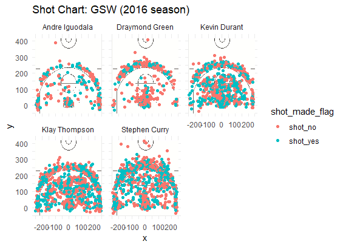

Golden State Warriors (GSW) has become the most competitive team in NBA in 2010s. Gradually, it has gathered a team of most prestigious and skilled players. Even though the team is very strong, sometimes, people only focus on a few of famous players. Besides the most well-known players Curry, it is worth studying other players on the team who have also performed extraordinarily.  Recently, after I analyzed the shot statistics of these five starters, including Stephen Curry, Klay Thompson, Kevin Durant, Andre Iguodala and Draymond Green, in 2016 season, I found something very interesting to share. 

Normally, when someone mentions about Golden State Warriors, we often think of Stephen Curry and Kevin Durant, even if we only have the minimum knowledge of NBA. Their performance is so prominent that we always assume that they are the best players on the team, and they brought the success to GSW. To some extent, it is fair statement to make. The following table shows the total points each player made by 2-point and 3-point effective shooting throughout the 2016 season. 

```{r}
library(dplyr)
col_types <- c( "team_name" = "character", "game_date" = "character", "season" = "integer", "period" = "integer", "minutes_remaining" = "integer", "seconds_remaining" = "integer", "shot_made_flag" = "character", "action_type" = "factor", "shot_type" = "factor", "shot_distance" = "integer", "opponent" = "character",
               "x" = "integer", "y" = "integer", "name" = "character", "minute" = "integer")
players <- read.csv("C:/Berkeley/Spring19/stat133/hw-stat133/workout01/data/shots-data.csv", colClasses = col_types)
```
```{r}
total_pt_by_player <- group_by(players, name)

arrange(summarise(total_pt_by_player, total_points_made = 2 * length(shot_made_flag[shot_type == "2PT Field Goal" & shot_made_flag == "shot_yes"]) + 3 * length(shot_made_flag[shot_type == "3PT Field Goal" & shot_made_flag == "shot_yes"])), desc(total_points_made))
```

According to the table, Stephen Curry, as expected, contributed most points to the team, which is 1448. While Klay Thompson, following Curry, earned 1396 points in total. Kevin Durant, during his first year in GSW, also contributed over a thousand points. And comparing to the top three, Andre Iguodala and Draymond Green did not make a lot of points, which were 564 and 442, respectively. Their points were just around half, or even less than a half of the top three players. However, as I went deeper into the analysis of the data, I realized it is too early to conclude that Iguodala and Green are the "weaker" shooters on the team. 

Now let's examine closer at the effective shooting percentage by player. It refers to the overall effective shots, including both 2PT and 3PT field goals, over the total shots made. This percentage reflects the accuracy of the overall effective shooting. The following table shows the percentages of each player in a descending order. 

```{r}
total_shot_by_player <- group_by(players, name)
arrange(summarise(total_shot_by_player, total = length(shot_made_flag), made = length(shot_made_flag[shot_made_flag == "shot_yes"]), perc_made = length(shot_made_flag[shot_made_flag == "shot_yes"]) / length(shot_made_flag)), desc(perc_made))
```

According to the table, unlike the results from the previous table, Kevin Durant, with 54%, ranked the first among all five players. While Stephen Curry, though having the most points, only ranked the fourth. From this table, it's obvious that there is no strong correlation between points made and effectiveness of shooting. And according to the percentage, it is exciting to see that the last one on the list, Draymond Green, still had 42% of effectiveness. The difference between 54% and 42%, comparing to the difference between 1448 points and 442 points, is not too dramatic indeed. It shows that skill-wise, the team is average, and we can assume that the huge difference in points made was most likely just caused by their different roles. 

The following graphs are the shot charts of each player. These charts depict the location of each shot, and also indicate whether the shot was effective or not. The green dots are the effective ones, while the red dots are failures. 

```{r out.width='80%', echo=FALSE, fig.align='center'}

```

We can tell directly from the charts that there is no one who has significantly more green dots and red ones; instead, the major difference is number of dots. The graph also suggests that all the players had similar capability in shooting, which implies that the team is a balanced, strong team. 

Now, let's look into specific types of shots. First is 2PT field goals. Similarly, I also investigated effective shooting percentage by player, specifically 2PT field goals. The result is shown by the following table. 

```{r}
two_pt <- filter(players, shot_type == "2PT Field Goal")
two_pt_by_player <- group_by(two_pt, name)
arrange(summarise(two_pt_by_player, total = length(shot_made_flag), made = length(shot_made_flag[shot_made_flag == "shot_yes"]), perc_made = length(shot_made_flag[shot_made_flag == "shot_yes"]) / length(shot_made_flag)), desc(perc_made))

```

Surprisingly, Andre Iguodala ranked the top on the list with 64%. Kevin Durant and Stephen Curry followed Iguodala with 61% and 54%, respectively. From this table, we can tell that even though Iguodala only made 134 effective shots, which is way less than Durant (390 shots), his skill is still proven by his high accuracy. 

Second, we can look at 3PT field goals. The following table is the 3PT effective shooting percentage by player. 

```{r}
three_pt <- filter(players, shot_type == "3PT Field Goal")
three_pt_by_player <- group_by(three_pt, name)
arrange(summarise(three_pt_by_player, total = length(shot_made_flag), made = length(shot_made_flag[shot_made_flag == "shot_yes"]), perc_made = length(shot_made_flag[shot_made_flag == "shot_yes"]) / length(shot_made_flag)), desc(perc_made))
```

Even though we normally think of Curry for his outstanding performance in 3PT effective shooting, in fact, Klay Thompson ranked the first with 42%, and Curry followed with 41%. The range is 31% - 42%. The result implies the effort the team has put into 3PT shooting training, which has become their comparative advantage to other teams. However, in this case, the top three is consistent with the top three in the total-point ranking, so we can see that 3PT field goals can be very crucial to the player's and team's performance. 

Overall, what I have noticed that unlike other teams which only have one or two prominent players while the others are not strong enough, GSW is very balanced - all five of the starters are skilled players who can make major contribution to the team. There is no apparent weakness to other teams, at least in terms of effective shooting capabilities. With so many strong players who are in their best ages, it's very exciting to see how the team can continue growing, improving itself, keeping its dominance in NBA. I hope these players can bring us more unforgettable games in the future. 